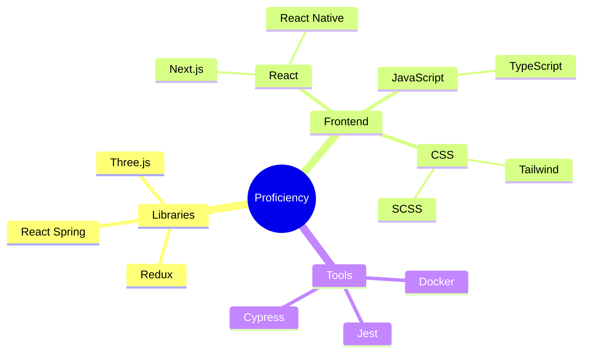

# [geoffreytan.dev](https://geoffreytan.dev/) &middot;  

<!-- - 👋 Hi, I’m @geoffrey-tan
- 👀 I’m interested in ...
- 🌱 I’m currently learning ...
- 💞️ I’m looking to collaborate on ...
- 📫 How to reach me ... -->

<!---
geoffrey-tan/geoffrey-tan is a ✨ special ✨ repository because its `README.md` (this file) appears on your GitHub profile.
You can click the Preview link to take a look at your changes.
--->

### Languages and Tools:

